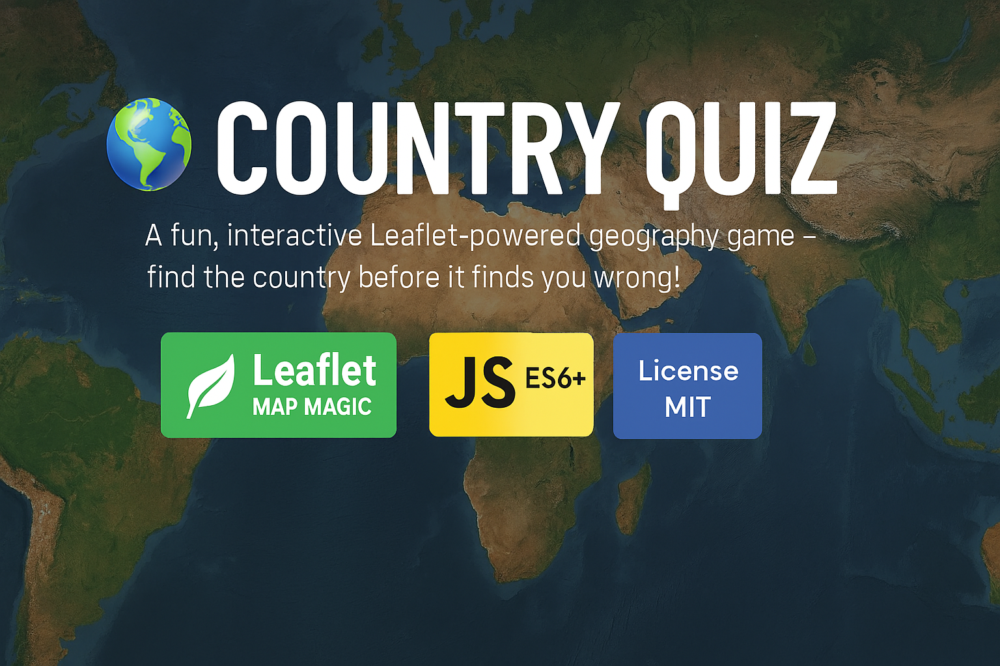

# 🌍 Country Quiz




---

## 🚀 Live Demo  

👉 [Play it Here!](https://def-fun7.github.io/guess_the_country/)

---

## ✨ Overview  

**Country Quiz** is a lightweight, browser‑based geography game built using **Leaflet.js** and real-world GIS data.  
Your mission is simple: **find the country shown in the prompt**.  
Guess right → you win.  
Guess wrong → enjoy a funny GIF and try again.

This project began as an experiment in using GIS components in a web game — and evolved into a clean, modular, and surprisingly addictive little challenge.

---

## 🎮 Features

* 🗺️ **Interactive World Map** using Leaflet + Esri World Imagery  
* 🔀 **Shuffle System** to generate random countries  
* 🧠 **Game Logic** for wins, losses, and skips  
* 📜 **History Log** showing your actions  
* 😂 **GIF Feedback** overlayed on the map for correct/incorrect guesses  
* 🧩 **Modular Codebase** (utils, game logic, effects, map init)  
* 🎨 **Refactored CSS** into base + components  

---

## 🕹️ How to Play

1. Click **Shuffle** to get a random country name.  
2. Click on the map to guess the country.  
3. A popup appears — choose **Confirm** or **Go Back**.  
4. Win or lose, you’ll get instant feedback (with GIFs!).  
5. Track your **Wins**, **Loses**, and **Skips** below the map.  
6. Stuck? Hit **Give Up** to reveal the answer (counts as a loss).

---

## 📂 Project Structure

. ├── assets/ ├── src/ │ ├── css/ │ │ └── main.css │ └── js/ │ ├── countries.js # GeoJSON data │ ├── effects.js # GIF & popup logic │ ├── game.js # Shuffle & scoring │ ├── main.js # Map initialization │ └── utils.js # Helper functions └── index.html

---

## 🛠️ Tech Stack

| Technology     | Purpose |
|----------------|---------|
| **HTML5**      | Structure |
| **CSS3**       | Styling (base + components) |
| **JavaScript** | Game logic & interactivity |
| **Leaflet.js** | Map rendering & GIS features |

---

# 📘 About *Country Quiz*

## 🧭 History & Motivation  

The idea was to build a small web game that uses **real-world maps** — something GIS‑flavored but simple enough to complete.  
After exploring a long list of ambitious ideas (see below), this one stood out as the most practical and fun.

The core gameplay is intentionally simple:  
You’re shown a country name → you locate it on the map.  
Correct? You score a win.  
Wrong? You lose — and a funny GIF appears as punishment.

This also served as a chance to experiment with **Leaflet overlays**, popups, and interactive layers.

> **Note:** The `countries.js` dataset comes from the excellent  
> [geo-countries](https://github.com/datasets/geo-countries) project.  
> Precision may vary slightly.

---

## 💡 Previous Ideas  

Before settling on Country Quiz, several other concepts were explored:

* **“Cat’s Cradle”** — a complex story‑driven simulation inspired by  
  *Groundhog City Simulation* by chri7928  
* **Map projection experiments** using **D3.js**  
* **End‑of‑the‑world interactive sketch game** using **p5.js + Leaflet**  
* **Historical border timeline maps**, similar to  
  * [Historic Borders](https://historicborders.app/)  
  * [Points in History](https://hanshack.com/point-in-history/)  
* **Projection comparison tool** showing how a country’s shape changes across map projections  

All fun ideas — but Country Quiz was the one that clicked.

---

## ⚙️ Installation (Local Setup)

1. Clone the repository:

   ```bash
   git clone https://github.com/def-fun7/p_c.git
   cd p_c

2. Open `index.html` in your browser.

No build tools, no dependencies — everything runs locally.

## 🤝 Contributing

Suggestions, issues, and pull requests are welcome.

Feel free to help improve the game, add features, or refine the map data.

## 📄 License

This project is licensed under the **MIT License**.
